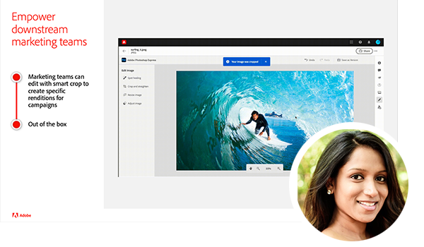

# Adobe Content Management Forum {#overview}

Lär dig av Adobe experter när de diskuterar det aktuella och framtida läget för innehållshanteringsstrategi, slutprodukter, utmaningar och tekniska krav. Det virtuella evenemanget innehåller ett särskilt inledningsanförande från Kurt Benkert, NFL quarterback och affärskonsult samt Haresh Kumar, Director of Strategy and Product Marketing, där de diskuterar hur ni med rätt verktyg kan få tillgång till kreativt material och förenkla rutinuppgifterna för att kunna utnyttja kraften i innehållets snabbhet.

Delta i sessionerna nedan och lär dig mer:

* Så här moderniserar ni upplevelsehanteringen som gör det kreativt att skapa innehåll, gör flerkanalsleverans till en lätt match och skalar personalisering så att alla upplevelser räknas.
* Så här skapar du en innehållsleveranskedja som kan anpassas efter personalisering
* Hur man snabbar upp time to market för att skapa nya webbplatser och minskar beroendet av tekniska resurser
* De senaste innovationerna för [!DNL Experience Manager] som erbjuds som en molnbaserad tjänst och hur du anpassar dig efter föränderliga marknadsförväntningar samtidigt som du håller dig i framkanten
* Så här skapar du webbplatser snabbare med Adobe [!DNL Experience Manager] som ett headless CMS med GraphQL och Content Fragments
* Bästa praxis för utvecklare som snabbar upp time-to-market för Adobe Experience Manager Sites

>[!TIP]
>
>**Alla inspelade sessioner visas i navigeringen till vänster**.

<table>
  <tr>
   <td>
      
      

         <a href="2022/welcome.md"><strong>Välkomstadress och AEM översikt</strong></a>         
          <em> med Elliot Sedegah, Haresh Kumar och Kurt Benkert </em>
      

      

         
         Välkommen till Adobe Content Management Forum-eventserien. I den här videon kan du titta på välkomstadressen och få en AEM översikt och höra om hur du kan frigöra hastigheten för innehållet.
      

   </td>
   <td>
      
      

         <a href="2022/assets-for-all.md"><strong>Utöka Adobe [!DNL Experience Manager] utan rubrik med Adobe [!DNL App Builder]</strong></a>         
          <em> med Purnima Rachoor Roy </em>
      

      

         
          Läs om hur [!DNL Assets Essentials] är det nya [!DNL Digital Asset Management] systemet för avdelningar och medelstora företag.
      

   </td>
   <td>
      
      

         <a href="2022/supply-chain.md"><strong>Skapar en innehållsleveranskedja som skalas</strong></a>         
          <em> med Marc Angelinovich </em>
      

      

         
         Lär dig hur du skapar en innehållsleverantörskedja som kan anpassas efter personalisering.
      

   </td>
  </tr>
</table>
