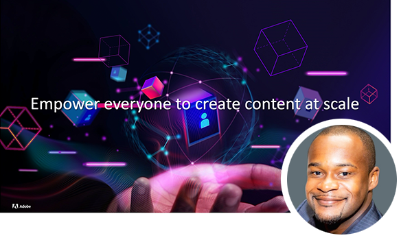
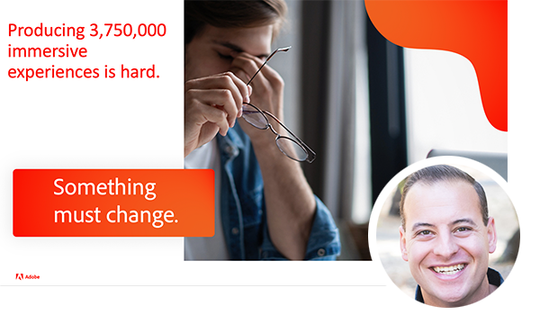

# Adobe Content Management Forum {#overview}

Lär dig av Adobe experter när de diskuterar det aktuella och framtida läget för innehållshanteringsstrategi, slutprodukter, utmaningar och tekniska krav. Det virtuella evenemanget innehåller ett särskilt inledningsanförande från Kurt Benkert, NFL quarterback och affärskonsult samt Haresh Kumar, Director of Strategy and Product Marketing, där de diskuterar hur ni med rätt verktyg kan få tillgång till kreativt material och förenkla rutinuppgifterna för att kunna utnyttja kraften i innehållets snabbhet.

Delta i sessionerna nedan och lär dig mer:

* Så här moderniserar ni upplevelsehanteringen som gör det kreativt att skapa innehåll, gör flerkanalsleverans till en lätt match och skalar personalisering så att alla upplevelser räknas.
* Så här skapar du en innehållsleveranskedja som kan anpassas efter personalisering
* Hur man snabbar upp time to market för att skapa nya webbplatser och minskar beroendet av tekniska resurser
* De senaste innovationerna för Experience Manager som erbjuds som molnbaserade tjänster och hur ni anpassar er efter föränderliga förväntningar på marknaden samtidigt som ni håller er i framkant
* Skapa webbplatser snabbare med Adobe Experience Manager som ett headless CMS med GraphQL och Content Fragments
* Bästa praxis för utvecklare som snabbar upp time-to-market för Adobe Experience Manager Sites

>[!TIP]
>
>**Alla inspelade sessioner visas i navigeringen till vänster**.

<table>
  <tr>
   <td>
      
      

         <a href="2022/welcome.md"><strong>Välkomstadress och AEM</strong></a>         
          <em>med Elliot Sedegah, Haresh Kumar och Kurt Benkert</em>
      

      

         
         Välkommen till Adobe Content Management Forum-eventserien. I den här videon kan du titta på välkomstadressen och få en AEM översikt och höra om hur du kan frigöra hastigheten för innehållet.
      

   </td>
   <td>
      
      

         <a href="2022/assets-for-all.md"><strong>Utöka Adobe Experience Manager Headless med Adobe App Builder</strong></a>         
          <em>med Purnima rachoor Roy</em>
      

      

         
          Läs om hur Assets Essentials är det nya Digital Asset Management-systemet för avdelningar och medelstora företag.
      

   </td>
   <td>
      
      

         <a href="2022/supply-chain.md"><strong>Bygga en innehållsleveranskedja som skalas</strong></a>         
          <em>med Marc Angelinovich</em>
      

      

         
         Lär dig hur du skapar en innehållsleverantörskedja som kan anpassas efter personalisering.
      

   </td>
  </tr>
</table>
