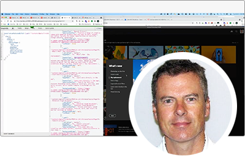

# Adobe Developers Live {#overview}

Adobe Developers Live för samman utvecklare av Adobe och upplevelseskapare med olika bakgrunder och ett enda syfte - för att skapa fantastiska helhetsupplevelser. Den här tvådagarskonferensen kommer att innehålla viktiga uppdateringar för utvecklare, tekniska sessioner och möjligheter till communitynätverk.

Adobe produktteam i Adobe Experience Cloud, Document Cloud och Creative Cloud kommer att visa upp de senaste tekniska framstegen och utvecklarverktygen för design, arbetsflöden för innehållsskapande, dokumenttjänster och hantering av kundupplevelser i olika branscher.

Registrera dig för framtida evenemang **[här](https://developerevents.adobe.com/)**.

>[!TIP]
>
>**Alla inspelade sessioner visas i navigeringen till vänster**.

## Oktober 2021

Adobe produktteam i Adobe Experience Cloud, Document Cloud och Creative Cloud har presenterat de senaste teknikframstegen och utvecklarverktygen för design, arbetsflöden för innehållsskapande, dokumenttjänster och hantering av kundupplevelser i olika branscher.

Kolla in de andra [sessioner](2021/october/overview.md) !

<table>
  <tr>
   <td>
      
      

         <a href="2021/october/headless.md"><strong>Headless Sites</strong></a>         
          <em>med Mathias Siegl, Principal Product Manager, AEM Sites</em>
      

      

         
         Med GraphQL for Content Fragments för AEM 6.5 och Adobe Experience Manager as a Cloud Service kan vi utforska hur Adobe Experience Manager kan användas som headless CMS.
      

     </td>   
     <td>
      
      

         <a href="2021/october/aep-integration.md"><strong>Översikt över Adobe Experience Platform-integrering</strong></a>
          <em>med Eric Knee, chef Enterprise Solution Architect</em>
      

      

         
         Under den här sessionen får du en överblick över olika sätt som Adobe Experience Platform kan integrera i ditt ekosystem och saker att tänka på när du planerar integreringsarbetet.
      

   </td>
   </td>
     <td>
      
      

         <a href="2021/october/pdf-services-api.md"><strong>Generera dokument och samla in e-signaturer i appar med Adobe Sign API</strong></a>
          <em>med Ben Vanderberg, Principal Developer Evangelist</em>
      

      

         
         Adobe Document Generation API är en kraftfull dokumentskapningstjänst som bygger på Microsoft Word-mallar som sammanfogas med dina data. I kombination med Adobe Sign API kan utvecklare enkelt generera dynamiska dokument som är klara att bearbetas via signeringsflödet.
      

   </td> 
  </tr>
</table>

## Februari 2021

Denna tvådagarskonferens innehåller viktiga uppdateringar för Adobe Experience Manager-utvecklare, som Headless och GraphQL, Adobe Experience Manager as a Cloud Service, tekniska sessioner och communitynätverk.

Kolla in de andra [sessioner](2021/february/overview.md).

<table>
  <tr>
   <td>
      
      

         <a href="2021/february/headless-graphql-content-fragments.md"><strong>Headless - GraphQL with Content Fragments</strong></a>         
          <em>med Jabran Asghar, Sr. Software Engineer</em>
      

      

         
         Läs om de nya headless-funktionerna med de senaste förbättringarna i Content Fragment. Under den här sessionen kommer vi att fokusera på GraphQL API för AEM Cloud Service.
      

     </td>   
     <td>
      
      

         <a href="2021/february/rapid-frontend-devlopment.md"><strong>Frontend Dev - Ditt framtida arbetsflöde för att snabbt bygga och driftsätta webbplatsens frontlinje.</strong></a>
          <em>med Gabriel Walt, Sr. Product Manager</em>
      

      

         
         Använd webbplatsmallar för att skapa nya webbplatser med bara några klick, och återställ det roliga i frontend-utvecklingen med den snabba driftsättningen av klientresurser som CSS&amp;JS.
      

   </td>
   </td>
     <td>
      
      

         <a href="2021/february/get-ready-aem-cloud.md"><strong>Gör dig redo för Cloud Servicen - Bästa praxis för migrering</strong></a>
          <em>med Andreea Moise, Sr. Software Engineer</em>
      

      

         
         Att anpassa kodbasen så att den blir molnvänlig och punktsäker mot framtida uppgraderingar som hanteras under huven är avgörande för att maximera fördelarna med AEM Cloud Service.
      

   </td>
  </tr>
</table>