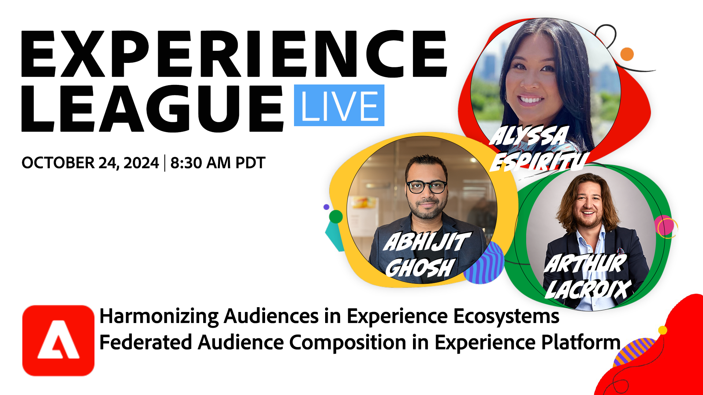

# Harmonisera målgrupper i Experience Ecosystems - Federated Audience Composition i Experience Platform

Läs om hur Federated Audience Composition erbjuder ett omfattande sätt att hantera målgruppsgenerering och -aktivering med Real-Time CDP och Journey Optimizer.

[Registrera dig för den här aktiviteten](https://engage.adobe.com/ExpLeagueLive-241024.html)

**Visa detaljer**:
Få utökad åtkomst till datalager i storföretag för att skapa målgrupper och hantera varumärkesinitierade och aktuella upplevelser.

Under den här sessionen får du lära dig att:

* Få åtkomst till kritiska lageruppsättningar utan att behöva kopiera underliggande data för att minimera dupliceringen.
* Sammanställ och berika värdefulla målgrupper med lagerbaserade datauppsättningar.
* Aktivera dessa målgrupper i flera kanaler för att stödja användningsfall med låg latens och skapa personaliserade upplevelser.
