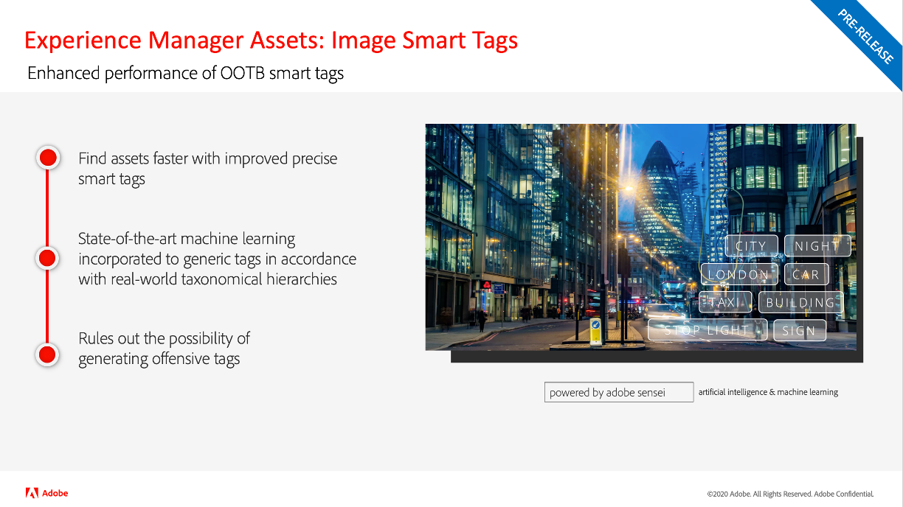
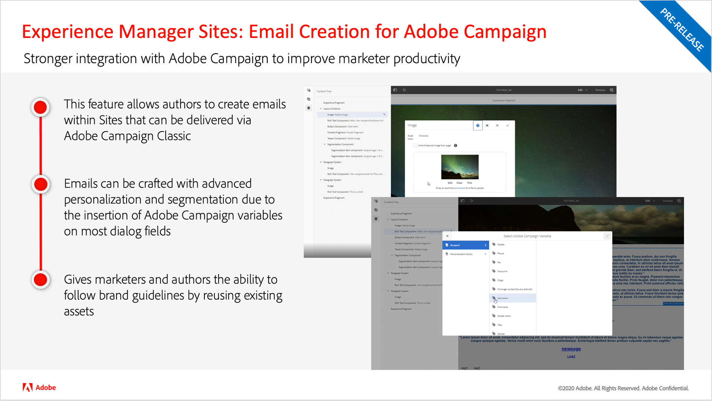

# Uppdateringar om Adobe Experience Manager as a Cloud Service

Få en snabb översikt över de senaste funktionerna i Adobe Experience Manager as a Cloud Service. Det här är korta, ungefär 10 minuter långa videor från AEM produktgrupp som delar med sig av de senaste releasernas högdagrar.
<!--
## Latest Update

<table style="max-width: 50%;">
  <tr>
    <td>
      
      

        <a href="2023/2023-7-0.md">
          <strong>Release | 2023.7.0</strong>
           
        </a>
          <em>Release date July 2023 </em>
      

      

        <a href="https://experienceleague.adobe.com/docs/experience-manager-cloud-service/content/release-notes/release-notes/release-notes-current.html">Release notes</a>
      

    </td>
  </tr>  
</table> 

## Past Updates

<table style="max-width: 50%;">
  <tr>
    <td>
      
      

        <a href="2023/2023-6-0.md">
          <strong>Release | 2023.6.0</strong>
           
        </a>
          <em>Release date June 2023 </em>
      

      

        <a href="https://experienceleague.adobe.com/docs/experience-manager-cloud-service/content/release-notes/release-notes/release-notes-current.html">Release notes</a>
      

    </td>
    <td>
      
      

        <a href="2023/2023-4-0.md">
          <strong>Release | 2023.4.0</strong>
           
        </a>
          <em>Release date June 2023 </em>
      

      

        <a href="https://experienceleague.adobe.com/docs/experience-manager-cloud-service/content/release-notes/release-notes/release-notes-current.html">Release notes</a>
      

    </td>
    <td>
      
      

        <a href="2023/2023-2-0.md">
          <strong>Release | 2023.2.0</strong>
           
        </a>
          <em>Release date Mar 2023 </em>
      

      

        <a href="https://experienceleague.adobe.com/docs/experience-manager-cloud-service/content/release-notes/release-notes/release-notes-current.html">Release notes</a>
      

    </td>
    <tr>
    <td>
      
      

        <a href="2023/2023-1-0.md">
          <strong>Release | 2023.1.0</strong>
           
        </a>
          <em>Release date  Feb 2023 </em>
      

      

        <a href="https://experienceleague.adobe.com/docs/experience-manager-cloud-service/content/release-notes/release-notes/release-notes-current.html">Release notes</a>
      

    </td>
    <td>
      
      

        <a href="2022/2022-10-0.md">
          <strong>Release | 2022.10.0</strong>
           
        </a>
          <em>Release date  Oct 13, 2022 </em>
      

      

        <a href="https://experienceleague.adobe.com/docs/experience-manager-cloud-service/content/release-notes/release-notes/release-notes-current.html">Release notes</a>
      

    </td>
    <td>
      
      

        <a href="2022/2022-8-0.md">
          <strong>Release | 2022.8.0</strong>
           
        </a>
          <em>Release date  Sept 1, 2022 </em>
      

      

        <a href="https://experienceleague.adobe.com/docs/experience-manager-cloud-service/content/release-notes/release-notes/release-notes-current.html">Release notes</a>
      

    </td>
    </tr>
    <td>
      
      

        <a href="2022/2022-7-0.md">
          <strong>Release | 2022.7.0</strong>
           
        </a>
          <em>Release date  Aug 8, 2022 </em>
      

      

        <a href="https://experienceleague.adobe.com/docs/experience-manager-cloud-service/content/release-notes/release-notes/release-notes-current.html">Release notes</a>
      

    </td>
    <td>
      
      

        <a href="2022/2022-6-0.md">
          <strong>Release | 2022.6.0</strong>
           
        </a>
          <em>Release date  June 30, 2022 </em>
      

      

        <a href="https://experienceleague.adobe.com/docs/experience-manager-cloud-service/content/release-notes/release-notes/release-notes-current.html">Release notes</a>
      

    </td>
    <td>
      
      

        <a href="2022/2022-5-0.md">
          <strong>Release | 2022.5.0</strong>
           
        </a>
          <em>Release date  June 9, 2022 </em>
      

      

        <a href="https://experienceleague.adobe.com/docs/experience-manager-cloud-service/content/release-notes/release-notes/release-notes-current.html">Release notes</a>
      

    </td>
  </tr>
</table>

 -->

## Senaste uppdatering

<table style="max-width: 50%;">
  <tr>
    <td>
      
      

        <a href="2023/2023-6-0.md">
          <strong>Frigör | 2023.6.0</strong>
           
        </a>
          <em>Releasedatum juni 2023 </em>
      

      

        <a href="https://experienceleague.adobe.com/docs/experience-manager-cloud-service/content/release-notes/release-notes/release-notes-current.html">Versionsinformation</a>
      

    </td>
  </tr>  
</table>

## Senaste uppdateringar

<table style="max-width: 50%;">
  <tr>
    <td>
      
      

        <a href="2023/2023-4-0.md">
          <strong>Frigör | 2023.4.0</strong>
           
        </a>
          <em>Releasedatum juni 2023 </em>
      

      

        <a href="https://experienceleague.adobe.com/docs/experience-manager-cloud-service/content/release-notes/release-notes/release-notes-current.html">Versionsinformation</a>
      

    </td>
    <td>
      
      

        <a href="2023/2023-2-0.md">
          <strong>Frigör | 2023.2.0</strong>
           
        </a>
          <em>Releasedatum mars 2023 </em>
      

      

        <a href="https://experienceleague.adobe.com/docs/experience-manager-cloud-service/content/release-notes/release-notes/release-notes-current.html">Versionsinformation</a>
      

    </td>
    <td>
      
      

        <a href="2023/2023-1-0.md">
          <strong>Frigör | 2023.1.0</strong>
           
        </a>
          <em>Releasedatum feb 2023 </em>
      

      

        <a href="https://experienceleague.adobe.com/docs/experience-manager-cloud-service/content/release-notes/release-notes/release-notes-current.html">Versionsinformation</a>
      

    </td>
  </tr>  
  <tr> 
    <td>
      
      

        <a href="2022/2022-10-0.md">
          <strong>Frigör | 2022.10.0</strong>
           
        </a>
          <em>Releasedatum 13 okt 2022 </em>
      

      

        <a href="https://experienceleague.adobe.com/docs/experience-manager-cloud-service/content/release-notes/release-notes/release-notes-current.html">Versionsinformation</a>
      

    </td>
    <td>
      
      

        <a href="2022/2022-8-0.md">
          <strong>Frigör | 2022.8.0</strong>
           
        </a>
          <em>Releasedatum 1 september 2022 </em>
      

      

        <a href="https://experienceleague.adobe.com/docs/experience-manager-cloud-service/content/release-notes/release-notes/release-notes-current.html">Versionsinformation</a>
      

    </td>
    <td>
      
      

        <a href="2022/2022-7-0.md">
          <strong>Frigör | 2022.7.0</strong>
           
        </a>
          <em>Releasedatum 8 aug 2022 </em>
      

      

        <a href="https://experienceleague.adobe.com/docs/experience-manager-cloud-service/content/release-notes/release-notes/release-notes-current.html">Versionsinformation</a>
      

    </td>
</tr>
<tr>
    <td>
      
      

        <a href="2022/2022-6-0.md">
          <strong>Frigör | 2022.6.0</strong>
           
        </a>
          <em>Releasedatum 30 juni 2022 </em>
      

      

        <a href="https://experienceleague.adobe.com/docs/experience-manager-cloud-service/content/release-notes/release-notes/release-notes-current.html">Versionsinformation</a>
      

    </td>
    <td>
      
      

        <a href="2022/2022-5-0.md">
          <strong>Frigör | 2022.5.0</strong>
           
        </a>
          <em>Releasedatum 9 juni 2022 </em>
      

      

        <a href="https://experienceleague.adobe.com/docs/experience-manager-cloud-service/content/release-notes/release-notes/release-notes-current.html">Versionsinformation</a>
      

    </td>
    <td>
      
      

        <a href="2022/2022-4-0.md">
          <strong>Frigör | 2022.4.0</strong>
           
        </a>
          <em>Utgiven 5 maj 2022 </em>
      

      

        <a href="https://experienceleague.adobe.com/docs/experience-manager-cloud-service/content/release-notes/release-notes/release-notes-current.html">Versionsinformation</a>
      

    </td>
  </tr>
</table>

