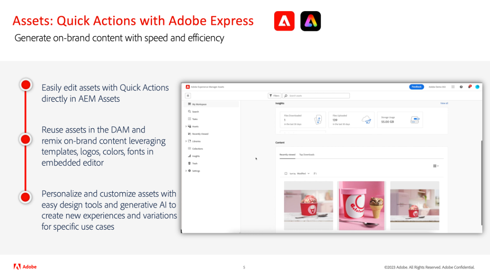

# Uppdateringar om Adobe Experience Manager as a Cloud Service

Få en snabb översikt över de senaste funktionerna i Adobe Experience Manager as a Cloud Service. Det här är korta, ungefär 10 minuter långa videor från AEM produktgrupp som delar med sig av de senaste releasernas högdagrar.

## Senaste uppdatering

<table style="max-width: 50%;">
  <tr>
    <td>
      
      

        <a href="2024/2024-5-0.md">
          <strong>Frigör | 2024.5.0</strong>
        </a>
      

      <em>Releasedatum maj 2024 </em>
      

        <a href="https://experienceleague.adobe.com/docs/experience-manager-cloud-service/content/release-notes/release-notes/release-notes-current.html">Versionsinformation</a>
      

    </td>
  </tr>  
</table>

## Senaste uppdateringar

<table style="max-width: 50%;">
  <tr>
    <td>
      
      

        <a href="2024/2024-4-0.md">
          <strong>Frigör | 2024.4.0</strong>
        </a>
      

      <em>Releasedatum april 2024 </em>
    </td>
    <td>
      
      

        <a href="2024/2024-3-0.md">
          <strong>Frigör | 2024.3.0</strong>
        </a>
      

      <em>Releasedatum april 2024 </em>
    </td>
    <td>
      
      

        <a href="2024/2024-1-0.md">
          <strong>Frigör | 2024.1.0</strong>
           
        </a>
          <em>Releasedatum januari 2024 </em>
      

    </td>
  </tr>
  <tr>
    <td>
      
      

        <a href="2023/2023-11-0.md">
          <strong>Frigör | 2023.11.0</strong>
           
        </a>
          <em>Releasedatum november 2023 </em>
      

    </td>
    <td>
      
      

        <a href="2023/2023-10-0.md">
          <strong>Frigör | 2023.10.0</strong>
           
        </a>
          <em>Releasedatum oktober 2023 </em>
      

    </td>
    <td>
      
      

        <a href="2023/2023-9-0.md">
          <strong>Frigör | 2023.9.0</strong>
           
        </a>
          <em>Releasedatum september 2023 </em>
      

    </td>
  </tr>
  <tr>    
    <td>
      
      

        <a href="2023/2023-8-0.md">
          <strong>Frigör | 2023.8.0</strong>
           
        </a>
          <em>Releasedatum augusti 2023 </em>
      

    </td>
    <td>
      
      

        <a href="2023/2023-7-0.md">
          <strong>Frigör | 2023.7.0</strong>
           
        </a>
          <em>Releasedatum juli 2023 </em>
      

    </td>
    <td>
      
      

        <a href="2023/2023-6-0.md">
          <strong>Frigör | 2023.6.0</strong>
           
        </a>
          <em>Releasedatum juni 2023 </em>
      

    </td>
  </tr>
</table>
