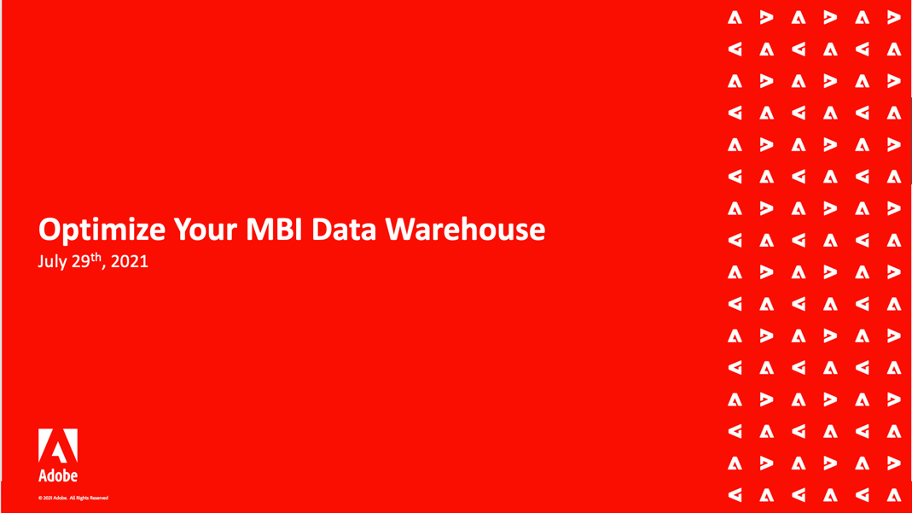

# Adobe Commerce Intelligence Webinars

>[!NOTE]
>
>Adobe Commerce Intelligence kallades tidigare [!DNL Magento Business Intelligence (MBI)]. Inspelningar för tidigare händelser återspeglar det tidigare namnet.

Webbseminariet Commerce Intelligence är en periodisk händelse för Commerce Intelligence-kunder. Webbinarierna täcker ett brett urval av ämnen och bästa metoder för att använda Commerce Intelligence i sin fulla potential.

Deltagare från alla platser kan delta i evenemangen live för att bättre förstå produkten och få sina frågor om funktionen för Commerce Intelligence besvarade direkt.

Frågorna upprepas då och då för att ge plats åt eventuella nya frågor som kunderna ställer.

## Personalval

<table>
<tr>
  <td>
    
     

      <a href="https://experienceleague.adobe.com/docs/events/commerce-intelligence-webinar-recordings/2023/getting-started.html">
        <strong>Komma igång med Commerce Intelligence</strong>
      </a>
    

    

    <em>Lär dig mer om huvudfunktionerna i Commerce Intelligence direkt från produktteamet med en djupdykning i förkonfigurerade instrumentpaneler och tillgängliga anpassningsalternativ.</em>
    

  </td>
  <td>
    
     

      <a href="https://experienceleague.adobe.com/docs/events/commerce-intelligence-webinar-recordings/2023/manage-data-sets.html">
        <strong>Hantera datauppsättningar i MBI</strong>
      </a>
    

    

    <em>Läs om några av de kraftfulla funktionerna i MBI Data Warehouse Manager, direkt från Adobe Commerce produktteam. Gå steget längre än att skapa grundläggande rapporter och lär dig hur du kan göra mer med dina data.</em>
    

  </td>
   <td>
    
     

      <a href="https://experienceleague.adobe.com/docs/events/commerce-intelligence-webinar-recordings/2021/optimize-data-warehouse.html">
        <strong>Optimera din MBI-Data Warehouse</strong>
      </a>
    

    

    <em>Med hjälp av Data Warehouse Manager kan du hantera tabell- och kolumnsynkroniseringsinställningar, gå nedåt i en tabells schema och skapa beräknade kolumner som kan användas i rapporter.</em>
    

  </td>
</tr>
</table>

>[!TIP]
>
>**Alla inspelade webbinarier visas i navigeringen till vänster**.

## Användbara resurser

- [Commerce Intelligence-videor och självstudiekurser](https://experienceleague.adobe.com/docs/commerce-learn/tutorials/mbi/filter-sets.html)
- [Användarhandbok för Commerce Intelligence](https://experienceleague.adobe.com/docs/commerce-business-intelligence/mbi/guide-overview.html?lang=sv)
