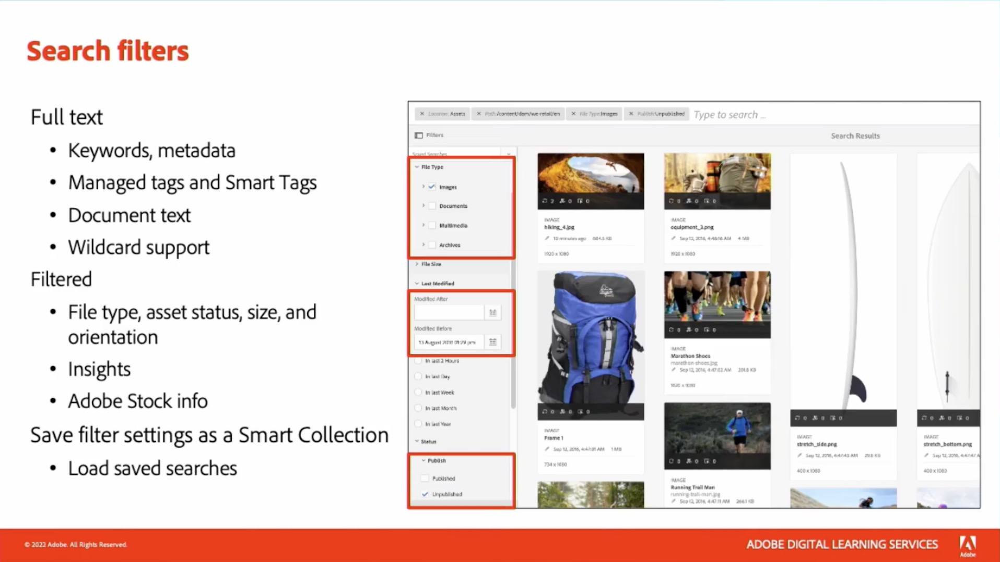

# Content and Commerce

Skapa och hantera en rad engagerande webbplatser, mobilappar och formulär. Lär dig också att bygga flerkanalsupplevelser på en enda plattform med vår flexibla AI-baserade handelslösning.

## Nyheter

<table>
<tr>
  <td>
    
     

      <a href="https://experienceleague.adobe.com/docs/skill-builder-events/skill-builder/content-and-commerce/2022/headless.html">
        <strong>Leverera Headless-upplevelser med Adobe Experience Manager</strong>
      </a>
    

    

    <em>Läs om headless Experience Management med de senaste förbättringarna av innehållsfragment i Experience Manager och det nya GraphQL-API:t för headless-leverans.</em>
    

  </td>
  <td>
    
     

      <a href="https://experienceleague.adobe.com/docs/skill-builder-events/skill-builder/content-and-commerce/2022/metadata.html">
        <strong>Få Metadata att fungera i Adobe Experience Manager Assets</strong>
      </a>
    

    

    <em>Lär dig hur du får ut så mycket som möjligt av dina metadata i AEM Assets genom att minska arbetsinsatsen för att tagga resurser och göra dina resurser mer sökbara.</em>
    

  </td>  
  <td>
    
     

      <a href="https://experienceleague.adobe.com/docs/skill-builder-events/skill-builder/content-and-commerce/2022/workflow.html">
        <strong>Få ut det mesta av Enterprise Workflow Management</strong>
      </a>
    

    

    <em>Under den här sessionen får du lära dig fördelarna med att använda arbetsflöden för din resurshantering och hur du snabbt skapar dem.</em>
    

  </td>
</tr>
</table>

>[!TIP]
>
>**Alla inspelade sessioner visas i navigeringen till vänster**.
